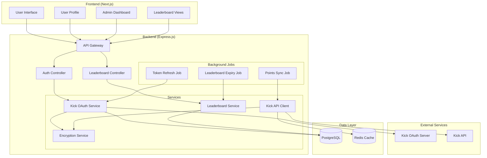

# Design Document: Kick OAuth Integration and Manual Leaderboard System

## Overview

This design document outlines the technical implementation for integrating Kick OAuth authentication and implementing a manual leaderboard system for the streaming backend platform. The system will extend the existing Discord-based authentication to support Kick platform integration, enabling users to link their Kick accounts and use Kick channel points for platform activities. Additionally, a separate manual leaderboard system will be implemented to track gambling wagers entered by administrators.

### Key Features

1. **Kick OAuth Integration**: Complete OAuth 2.0 flow for Kick authentication
2. **Kick Channel Points Synchronization**: Periodic fetching and caching of user channel points
3. **Manual Leaderboard System**: Admin-managed competitions with wager tracking
4. **Dual Points System**: Support for both local points and Kick channel points
5. **Security and Encryption**: Secure token storage and API communication
6. **Background Processing**: Automated token refresh and points synchronization

## Architecture

### High-Level Architecture



### Service Architecture

The system follows a layered architecture with clear separation of concerns:

1. **Presentation Layer**: Next.js frontend with React components
2. **API Layer**: Express.js controllers handling HTTP requests
3. **Service Layer**: Business logic and external API integration
4. **Data Layer**: PostgreSQL for persistent storage, Redis for caching
5. **Background Processing**: Scheduled jobs for maintenance tasks

## Components and Interfaces

### 1. Kick OAuth Service

**Purpose**: Handles the complete OAuth 2.0 flow for Kick authentication.

**Key Methods**:

```typescript
interface KickOAuthService {
  generateAuthURL(state: string): string;
  exchangeCodeForTokens(code: string): Promise<KickTokens>;
  refreshAccessToken(refreshToken: string): Promise<KickTokens>;
  validateToken(accessToken: string): Promise<boolean>;
  revokeTokens(userId: string): Promise<void>;
}

interface KickTokens {
  accessToken: string;
  refreshToken: string;
  expiresIn: number;
  tokenType: string;
}
```

**Security Features**:

- State parameter validation for CSRF protection
- Token encryption before database storage
- Secure token transmission over HTTPS
- Automatic token refresh with exponential backoff

### 2. Kick API Client

**Purpose**: Interfaces with Kick's API to fetch user data and channel points.

**Key Methods**:

```typescript
interface KickAPIClient {
  getUserInfo(accessToken: string): Promise<KickUser>;
  getChannelPoints(accessToken: string, channelId: string): Promise<number>;
  validateChannelAccess(
    accessToken: string,
    channelId: string,
  ): Promise<boolean>;
}

interface KickUser {
  id: string;
  username: string;
  displayName: string;
  avatar?: string;
  verified: boolean;
}
```

**Error Handling**:

- Automatic retry with exponential backoff
- Rate limit detection and queuing
- Token refresh on 401 errors
- Comprehensive error logging

### 3. Leaderboard Service

**Purpose**: Manages manual leaderboard competitions and wager tracking.

**Key Methods**:

```typescript
interface LeaderboardService {
  createLeaderboard(data: CreateLeaderboardRequest): Promise<Leaderboard>;
  addWager(leaderboardId: string, wager: WagerData): Promise<void>;
  getRankings(leaderboardId: string): Promise<LeaderboardRanking[]>;
  expireLeaderboards(): Promise<void>;
  exportLeaderboardData(leaderboardId: string): Promise<ExportData>;
}

interface CreateLeaderboardRequest {
  title: string;
  description?: string;
  prizePool: string;
  startDate: Date;
  endDate: Date;
  prizes: PrizeDistribution[];
}

interface WagerData {
  userId: string;
  amount: number;
  notes?: string;
  verifiedBy: string;
}

interface LeaderboardRanking {
  rank: number;
  userId: string;
  username: string;
  totalWagers: number;
  wagerCount: number;
  prize?: string;
}
```

### 4. Encryption Service

**Purpose**: Handles encryption and decryption of sensitive data.

**Key Methods**:

```typescript
interface EncryptionService {
  encrypt(plaintext: string): string;
  decrypt(ciphertext: string): string;
  generateSecureState(): string;
  hashToken(token: string): string;
}
```

**Implementation**:

- AES-256-GCM encryption for OAuth tokens
- Secure random state generation
- Key derivation from environment variables
- Salt-based token hashing

### 5. Background Job System

**Purpose**: Handles scheduled tasks for maintenance and synchronization.

**Jobs**:

1. **Token Refresh Job** (every 30 minutes):
   - Identifies tokens expiring within 1 hour
   - Attempts refresh using refresh tokens
   - Marks failed authentications as expired

2. **Points Synchronization Job** (every 5 minutes):
   - Fetches updated channel points for all linked users
   - Updates cached balances in Redis
   - Handles API rate limits and errors

3. **Leaderboard Expiry Job** (every 1 minute):
   - Checks for leaderboards past their end date
   - Updates status to "ended"
   - Triggers winner notifications

## Data Models

### Enhanced User Model

The existing User model is extended with Kick-related fields:

```typescript
interface User {
  // Existing fields...
  kickId?: string; // Kick OAuth user ID
  kickUsername?: string; // Kick username
  kickAccessToken?: string; // Encrypted access token
  kickRefreshToken?: string; // Encrypted refresh token
  kickTokenExpiresAt?: Date; // Token expiration timestamp
  kickChannelPoints?: number; // Cached channel points (Redis)
}
```

### Leaderboard Models

```typescript
interface Leaderboard {
  id: string;
  title: string;
  description?: string;
  prizePool: string;
  status: "active" | "ended" | "cancelled";
  startDate: Date;
  endDate: Date;
  createdBy?: string;
  createdAt: Date;
  updatedAt: Date;
  metadata?: Record<string, any>;
}

interface LeaderboardPrize {
  id: string;
  leaderboardId: string;
  position: number;
  prizeAmount: string;
  prizeDescription?: string;
  createdAt: Date;
}

interface LeaderboardWager {
  id: string;
  leaderboardId: string;
  userId: string;
  wagerAmount: number;
  submittedAt: Date;
  verifiedBy?: string;
  verifiedAt?: Date;
  notes?: string;
}
```

### API Response Models

```typescript
interface KickAuthResponse {
  success: boolean;
  authUrl?: string;
  state?: string;
  error?: string;
}

interface LeaderboardResponse {
  success: boolean;
  data: {
    leaderboard: Leaderboard;
    rankings: LeaderboardRanking[];
    userRank?: number;
    timeRemaining?: number;
  };
}

interface PointsBalanceResponse {
  success: boolean;
  data: {
    localPoints: number;
    kickChannelPoints?: number;
    lastSyncAt?: Date;
  };
}
```

## Database Schema Updates

### New Tables

```sql
-- Leaderboards table (already exists in schema)
CREATE TABLE leaderboards (
  id UUID PRIMARY KEY DEFAULT gen_random_uuid(),
  title VARCHAR(255) NOT NULL,
  description TEXT,
  prize_pool VARCHAR(100) NOT NULL,
  status VARCHAR(20) DEFAULT 'active',
  start_date TIMESTAMP NOT NULL,
  end_date TIMESTAMP NOT NULL,
  created_by UUID REFERENCES users(id),
  created_at TIMESTAMP DEFAULT NOW(),
  updated_at TIMESTAMP DEFAULT NOW(),
  metadata JSONB
);

-- Leaderboard prizes table (already exists in schema)
CREATE TABLE leaderboard_prizes (
  id UUID PRIMARY KEY DEFAULT gen_random_uuid(),
  leaderboard_id UUID NOT NULL REFERENCES leaderboards(id) ON DELETE CASCADE,
  position INTEGER NOT NULL,
  prize_amount VARCHAR(100) NOT NULL,
  prize_description TEXT,
  created_at TIMESTAMP DEFAULT NOW(),
  UNIQUE(leaderboard_id, position)
);

-- Leaderboard wagers table (already exists in schema)
CREATE TABLE leaderboard_wagers (
  id UUID PRIMARY KEY DEFAULT gen_random_uuid(),
  leaderboard_id UUID NOT NULL REFERENCES leaderboards(id) ON DELETE CASCADE,
  user_id UUID NOT NULL REFERENCES users(id) ON DELETE CASCADE,
  wager_amount DECIMAL(12,2) NOT NULL,
  submitted_at TIMESTAMP DEFAULT NOW(),
  verified_by UUID REFERENCES users(id),
  verified_at TIMESTAMP,
  notes TEXT
);
```

### Updated User Table

```sql
-- Add Kick-related columns to existing users table
ALTER TABLE users ADD COLUMN kick_id VARCHAR(50) UNIQUE;
ALTER TABLE users ADD COLUMN kick_username VARCHAR(100) UNIQUE;
ALTER TABLE users ADD COLUMN kick_access_token TEXT;
ALTER TABLE users ADD COLUMN kick_refresh_token TEXT;
ALTER TABLE users ADD COLUMN kick_token_expires_at TIMESTAMP;

-- Create indexes for performance
CREATE INDEX idx_users_kick_id ON users(kick_id);
CREATE INDEX idx_users_kick_username ON users(kick_username);
CREATE INDEX idx_leaderboard_wagers_leaderboard_user ON leaderboard_wagers(leaderboard_id, user_id);
CREATE INDEX idx_leaderboards_status_dates ON leaderboards(status, start_date, end_date);
```

## API Endpoints

### Kick OAuth Endpoints

```typescript
// Initiate Kick OAuth flow
POST /api/auth/kick/initiate
Response: { authUrl: string, state: string }

// Handle OAuth callback
GET /api/auth/kick/callback?code=...&state=...
Response: Redirect to frontend with tokens

// Unlink Kick account
DELETE /api/auth/kick/unlink
Headers: Authorization: Bearer <token>
Response: { success: boolean, message: string }

// Get Kick account status
GET /api/auth/kick/status
Headers: Authorization: Bearer <token>
Response: { linked: boolean, username?: string, channelPoints?: number }
```

### Leaderboard Management Endpoints

```typescript
// Create leaderboard (Admin only)
POST /api/admin/leaderboards
Body: CreateLeaderboardRequest
Response: { success: boolean, leaderboard: Leaderboard }

// Get leaderboards
GET /api/leaderboards?status=active&limit=10
Response: { success: boolean, leaderboards: Leaderboard[] }

// Get leaderboard details
GET /api/leaderboards/:id
Response: LeaderboardResponse

// Add wager (Admin only)
POST /api/admin/leaderboards/:id/wagers
Body: { userId: string, amount: number, notes?: string }
Response: { success: boolean, wager: LeaderboardWager }

// Export leaderboard data (Admin only)
GET /api/admin/leaderboards/:id/export
Response: CSV file download
```

### Points and Balance Endpoints

```typescript
// Get user points balance
GET /api/users/points
Headers: Authorization: Bearer <token>
Response: PointsBalanceResponse

// Use points for transaction
POST /api/transactions/spend
Body: { amount: number, type: 'local' | 'kick', purpose: string }
Response: { success: boolean, newBalance: number }
```

## Security Considerations

### OAuth Security

1. **State Parameter Validation**: Prevents CSRF attacks during OAuth flow
2. **Token Encryption**: All OAuth tokens encrypted with AES-256 before storage
3. **Secure Transmission**: HTTPS required for all OAuth communications
4. **Token Rotation**: Automatic refresh token rotation on each use
5. **Scope Limitation**: Request minimal required OAuth scopes

### API Security

1. **Authentication**: JWT-based authentication for all protected endpoints
2. **Authorization**: Role-based access control (Admin, Moderator, User)
3. **Rate Limiting**: Per-IP and per-user rate limits
4. **Input Validation**: Comprehensive validation of all inputs
5. **SQL Injection Prevention**: Parameterized queries and ORM usage

### Data Protection

1. **Encryption at Rest**: Sensitive data encrypted in database
2. **Encryption in Transit**: TLS 1.3 for all communications
3. **Key Management**: Environment-based key storage
4. **Data Minimization**: Store only necessary user data
5. **Audit Logging**: Comprehensive audit trail for admin actions

## Error Handling

### Kick API Error Handling

```typescript
class KickAPIError extends Error {
  constructor(
    public statusCode: number,
    public errorCode: string,
    message: string,
    public retryable: boolean = false,
  ) {
    super(message);
  }
}

// Error handling strategy
const handleKickAPIError = (error: any): KickAPIError => {
  switch (error.status) {
    case 401:
      return new KickAPIError(
        401,
        "UNAUTHORIZED",
        "Token expired or invalid",
        true,
      );
    case 429:
      return new KickAPIError(429, "RATE_LIMITED", "Rate limit exceeded", true);
    case 500:
      return new KickAPIError(500, "SERVER_ERROR", "Kick server error", true);
    default:
      return new KickAPIError(
        error.status || 500,
        "UNKNOWN",
        error.message,
        false,
      );
  }
};
```

### Retry Logic

```typescript
interface RetryConfig {
  maxRetries: number;
  baseDelay: number;
  maxDelay: number;
  backoffMultiplier: number;
}

const defaultRetryConfig: RetryConfig = {
  maxRetries: 3,
  baseDelay: 1000,
  maxDelay: 30000,
  backoffMultiplier: 2,
};
```

## Testing Strategy

### Unit Testing

1. **Service Layer Tests**: Mock external dependencies, test business logic
2. **Controller Tests**: Test API endpoints with mocked services
3. **Utility Tests**: Test encryption, validation, and helper functions
4. **Error Handling Tests**: Verify proper error responses and logging

### Integration Testing

1. **OAuth Flow Tests**: End-to-end OAuth authentication testing
2. **API Integration Tests**: Test Kick API client with mock server
3. **Database Tests**: Test data persistence and retrieval
4. **Background Job Tests**: Test scheduled task execution

### Security Testing

1. **Authentication Tests**: Verify JWT validation and expiration
2. **Authorization Tests**: Test role-based access controls
3. **Input Validation Tests**: Test against injection attacks
4. **Encryption Tests**: Verify token encryption/decryption

### Performance Testing

1. **Load Testing**: Test API endpoints under high load
2. **Database Performance**: Test query performance with large datasets
3. **Cache Performance**: Test Redis caching effectiveness
4. **Background Job Performance**: Test job execution times

## Deployment and Operations

### Environment Configuration

```typescript
interface KickConfig {
  KICK_CLIENT_ID: string;
  KICK_CLIENT_SECRET: string;
  KICK_REDIRECT_URI: string;
  KICK_API_BASE_URL: string;
  KICK_OAUTH_BASE_URL: string;
  ENCRYPTION_KEY: string;
  ENCRYPTION_IV: string;
}
```

### Monitoring and Logging

1. **API Metrics**: Response times, error rates, throughput
2. **Background Job Monitoring**: Job success rates, execution times
3. **External API Monitoring**: Kick API availability and performance
4. **Security Monitoring**: Failed authentication attempts, suspicious activity

### Backup and Recovery

1. **Database Backups**: Daily automated backups with point-in-time recovery
2. **Configuration Backups**: Environment variable and configuration backups
3. **Disaster Recovery**: Multi-region deployment capability
4. **Data Retention**: Configurable retention policies for audit logs

## Migration Strategy

### Phase 1: Core Infrastructure

1. Deploy Kick OAuth service and API client
2. Update database schema with new tables and columns
3. Implement encryption service and token management

### Phase 2: User-Facing Features

1. Deploy OAuth flow in frontend
2. Implement points synchronization
3. Add Kick account linking to user profiles

### Phase 3: Leaderboard System

1. Deploy leaderboard management APIs
2. Implement admin dashboard features
3. Add background job processing

### Phase 4: Integration and Testing

1. End-to-end testing of all features
2. Performance optimization
3. Security audit and penetration testing

## Performance Considerations

### Caching Strategy

1. **Redis Caching**: Cache channel points, user sessions, and API responses
2. **Cache Invalidation**: Time-based and event-based cache invalidation
3. **Cache Warming**: Proactive cache population for frequently accessed data

### Database Optimization

1. **Indexing**: Strategic indexes on frequently queried columns
2. **Query Optimization**: Efficient queries with proper joins and filtering
3. **Connection Pooling**: Optimized database connection management

### API Performance

1. **Response Compression**: Gzip compression for API responses
2. **Pagination**: Efficient pagination for large datasets
3. **Rate Limiting**: Protect against abuse while maintaining performance

## Scalability Considerations

### Horizontal Scaling

1. **Stateless Services**: Design services to be stateless for easy scaling
2. **Load Balancing**: Distribute traffic across multiple service instances
3. **Database Sharding**: Prepare for database scaling if needed

### Vertical Scaling

1. **Resource Monitoring**: Monitor CPU, memory, and I/O usage
2. **Auto-scaling**: Implement auto-scaling based on metrics
3. **Performance Profiling**: Regular performance analysis and optimization

## Correctness Properties

_A property is a characteristic or behavior that should hold true across all valid executions of a system-essentially, a formal statement about what the system should do. Properties serve as the bridge between human-readable specifications and machine-verifiable correctness guarantees._

After analyzing the acceptance criteria, the following properties have been identified for property-based testing:

### Property 1: Token Exchange Consistency

_For any_ valid authorization code, the Kick OAuth service SHALL successfully exchange it for access and refresh tokens with proper expiration timestamps.

**Validates: Requirements 1.3**

### Property 2: Token Storage Completeness

_For any_ OAuth token response, the system SHALL store all required fields (user ID, username, access token, refresh token, expiration) in the database.

**Validates: Requirements 1.4**

### Property 3: Token Encryption Round-trip

_For any_ OAuth token, encrypting then decrypting the token SHALL produce the original token value.

**Validates: Requirements 1.5**

### Property 4: Username Uniqueness Validation

_For any_ Kick username that is already linked to a user account, attempting to link it to another account SHALL result in an error.

**Validates: Requirements 1.7**

### Property 5: Token Refresh Consistency

_For any_ expired access token with a valid refresh token, the refresh process SHALL produce a new valid access token with updated expiration.

**Validates: Requirements 2.1, 2.2**

### Property 6: Token Cleanup on Logout

_For any_ user logout action, all stored Kick OAuth tokens for that user SHALL be deleted from the system.

**Validates: Requirements 2.4**

### Property 7: Channel Points Storage

_For any_ valid channel points value fetched from Kick API, the system SHALL store the value in the user's profile.

**Validates: Requirements 3.2**

### Property 8: API Error Handling and Retry

_For any_ Kick API failure, the system SHALL log the error and implement appropriate retry logic based on error type.

**Validates: Requirements 3.3**

### Property 9: Batch Processing Completeness

_For any_ set of users with linked Kick accounts, the background job SHALL attempt to fetch channel points for all users.

**Validates: Requirements 4.2**

### Property 10: Balance Deduction Accuracy

_For any_ transaction using Kick channel points, the system SHALL deduct the exact transaction amount from the user's balance.

**Validates: Requirements 5.4**

### Property 11: Insufficient Balance Validation

_For any_ transaction where the amount exceeds the user's Kick channel points balance, the system SHALL return an insufficient balance error.

**Validates: Requirements 5.5**

### Property 12: Leaderboard Validation

_For any_ leaderboard creation request, the system SHALL validate that all required fields are present and the start date is before the end date.

**Validates: Requirements 6.2, 6.6**

### Property 13: Leaderboard Status Persistence

_For any_ newly created leaderboard, the system SHALL store it with status "active" in the database.

**Validates: Requirements 6.3**

### Property 14: Prize Distribution Storage

_For any_ prize distribution configuration, the system SHALL store each position's prize amount and description correctly.

**Validates: Requirements 6.4, 6.5**

### Property 15: Wager Data Persistence

_For any_ wager submission, the system SHALL store the wager with admin verification, timestamps, and all provided data.

**Validates: Requirements 7.3, 7.4**

### Property 16: Wager Aggregation

_For any_ user with multiple wagers in the same leaderboard, the system SHALL correctly sum all wager amounts for ranking calculation.

**Validates: Requirements 7.5**

### Property 17: Wager Amount Validation

_For any_ wager amount input, the system SHALL validate that it is a positive number greater than zero.

**Validates: Requirements 7.6, 7.7**

### Property 18: Ranking Calculation

_For any_ set of leaderboard participants with wagers, the system SHALL rank them correctly by total wager amount in descending order.

**Validates: Requirements 8.1**

### Property 19: Participant Data Display

_For any_ leaderboard participant, the system SHALL display their username, total wager amount, and rank position.

**Validates: Requirements 8.2**

### Property 20: Prize Display Accuracy

_For any_ leaderboard with defined prize distribution, the system SHALL display the correct prize amount next to each winning position.

**Validates: Requirements 8.4**

### Property 21: Countdown Calculation

_For any_ active leaderboard with a future end date, the system SHALL calculate and display the correct time remaining.

**Validates: Requirements 9.1**

### Property 22: Time Format Consistency

_For any_ time duration, the system SHALL format the countdown display according to the specified format rules based on remaining time.

**Validates: Requirements 9.4, 9.5, 9.6**

### Property 23: Leaderboard Expiration Detection

_For any_ leaderboard whose end date has passed, the system SHALL update its status to "ended".

**Validates: Requirements 10.2**

### Property 24: Ended Leaderboard Restrictions

_For any_ leaderboard with "ended" status, the system SHALL prevent new wagers from being entered.

**Validates: Requirements 10.3, 10.5**

### Property 25: Multi-field Search

_For any_ search query, the system SHALL search across both Discord display names and Kick usernames with case-insensitive matching.

**Validates: Requirements 11.1, 11.2**

### Property 26: Search Result Completeness

_For any_ user in search results, the system SHALL display Discord username, Kick username (if linked), and points balance.

**Validates: Requirements 11.3**

### Property 27: Search Result Sorting

_For any_ set of search results with multiple users, the system SHALL sort them alphabetically by Discord username.

**Validates: Requirements 11.4**

### Property 28: Points Conversion Prevention

_For any_ attempt to convert between Kick channel points and leaderboard wagers, the system SHALL block the conversion.

**Validates: Requirements 12.3**

## Error Handling

### Kick API Error Handling

```typescript
class KickAPIError extends Error {
  constructor(
    public statusCode: number,
    public errorCode: string,
    message: string,
    public retryable: boolean = false,
  ) {
    super(message);
  }
}

// Error handling strategy
const handleKickAPIError = (error: any): KickAPIError => {
  switch (error.status) {
    case 401:
      return new KickAPIError(
        401,
        "UNAUTHORIZED",
        "Token expired or invalid",
        true,
      );
    case 429:
      return new KickAPIError(429, "RATE_LIMITED", "Rate limit exceeded", true);
    case 500:
      return new KickAPIError(500, "SERVER_ERROR", "Kick server error", true);
    default:
      return new KickAPIError(
        error.status || 500,
        "UNKNOWN",
        error.message,
        false,
      );
  }
};
```

### Retry Logic

```typescript
interface RetryConfig {
  maxRetries: number;
  baseDelay: number;
  maxDelay: number;
  backoffMultiplier: number;
}

const defaultRetryConfig: RetryConfig = {
  maxRetries: 3,
  baseDelay: 1000,
  maxDelay: 30000,
  backoffMultiplier: 2,
};
```

## Testing Strategy

### Dual Testing Approach

The testing strategy employs both unit tests and property-based tests for comprehensive coverage:

- **Unit tests**: Verify specific examples, edge cases, UI behavior, and integration points
- **Property tests**: Verify universal properties across all inputs using randomized test data
- **Integration tests**: Verify external service interactions and end-to-end workflows

### Property-Based Testing Configuration

- **Testing Library**: Jest with fast-check for TypeScript property-based testing
- **Test Iterations**: Minimum 100 iterations per property test
- **Test Tagging**: Each property test tagged with format: **Feature: kick-oauth-manual-leaderboard, Property {number}: {property_text}**

### Unit Testing Focus Areas

1. **UI Components**: Verify specific display behaviors and user interactions
2. **Integration Points**: Test OAuth callbacks, API integrations, and external service interactions
3. **Edge Cases**: Test boundary conditions, empty states, and error scenarios
4. **Security**: Test authentication, authorization, and input validation

### Integration Testing

1. **OAuth Flow Tests**: End-to-end OAuth authentication testing with mock Kick services
2. **API Integration Tests**: Test Kick API client with mock server responses
3. **Background Job Tests**: Test scheduled task execution and error handling
4. **Real-time Updates**: Test WebSocket connections and live leaderboard updates

### Security Testing

1. **Authentication Tests**: Verify JWT validation, token expiration, and session management
2. **Authorization Tests**: Test role-based access controls for admin and user endpoints
3. **Input Validation Tests**: Test against injection attacks and malformed data
4. **Encryption Tests**: Verify token encryption/decryption and secure storage

### Performance Testing

1. **Load Testing**: Test API endpoints under high concurrent load
2. **Database Performance**: Test query performance with large datasets and complex joins
3. **Cache Performance**: Test Redis caching effectiveness and invalidation strategies
4. **Background Job Performance**: Test job execution times and resource usage

This design provides a comprehensive foundation for implementing Kick OAuth integration and the manual leaderboard system while maintaining security, performance, and scalability requirements.
