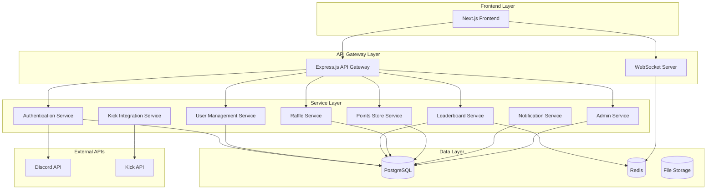

# Design Document: Streaming Backend System

## Overview

The streaming backend system is a comprehensive Node.js-based platform that supports user authentication, real-time leaderboards, points management, raffle systems, and external API integrations. The system serves a Next.js frontend and provides robust admin management capabilities for a streaming community platform.

### Key Features

- Dual authentication flow (Discord OAuth + Kick verification)
- Real-time leaderboard system with multiple ranking periods
- Points earning through stream viewing and engagement
- Comprehensive admin dashboard with full platform control
- Raffle and giveaway management with automated winner selection
- Points-based store system for digital rewards
- Live streaming status tracking and notifications
- Bonus hunt tracking with prediction capabilities

### Design Principles

- **Scalability**: Designed to handle thousands of concurrent users
- **Real-time Updates**: WebSocket-based real-time data synchronization
- **Security**: Role-based access control and comprehensive data protection
- **Reliability**: Fault-tolerant design with graceful degradation
- **Maintainability**: Modular architecture with clear separation of concerns

## Architecture

### System Architecture Overview

The system follows a microservices-inspired architecture with clear service boundaries while maintaining deployment simplicity. The architecture consists of:



### Technology Stack

**Backend Framework**

- **Node.js 20+**: Runtime environment with excellent async performance
- **Express.js 4.18+**: Web framework for REST API endpoints
- **Socket.io 4.7+**: WebSocket implementation for real-time updates
- **TypeScript 5.0+**: Type safety and enhanced developer experience

**Database & Caching**

- **PostgreSQL 15+**: Primary database for structured data and ACID transactions
- **Redis 7.0+**: Caching layer and real-time leaderboard storage
- **Prisma 5.0+**: Database ORM with type-safe queries and migrations

**Authentication & Security**

- **Passport.js**: Authentication middleware with OAuth strategies
- **JWT**: Stateless session management
- **bcrypt**: Password hashing (for admin accounts)
- **helmet**: Security headers and protection middleware
- **express-rate-limit**: API rate limiting

**External Integrations**

- **Discord.js**: Discord API integration
- **Axios**: HTTP client for external API calls
- **node-cron**: Scheduled tasks for leaderboard resets and maintenance

**Development & Deployment**

- **Jest**: Testing framework
- **ESLint + Prettier**: Code quality and formatting
- **Docker**: Containerization for consistent deployments
- **PM2**: Process management for production

## Components and Interfaces

### Authentication Service

**Purpose**: Handles dual authentication flow with Discord and Kick platforms

**Key Components**:

- `DiscordOAuthHandler`: Manages Discord OAuth 2.0 flow
- `KickVerificationHandler`: Handles Kick platform verification
- `SessionManager`: JWT token generation and validation
- `UserProfileManager`: Creates and updates user profiles

**Interfaces**:

```typescript
interface AuthenticationService {
  initiateDiscordAuth(redirectUrl: string): Promise<string>;
  handleDiscordCallback(code: string, state: string): Promise<AuthResult>;
  initiateKickVerification(userId: string): Promise<VerificationResult>;
  validateSession(token: string): Promise<UserSession>;
  refreshToken(refreshToken: string): Promise<TokenPair>;
  logout(userId: string): Promise<void>;
}

interface AuthResult {
  success: boolean;
  user?: UserProfile;
  token?: string;
  refreshToken?: string;
  error?: string;
  nextStep?: "kick_verification" | "complete";
}
```

### User Management Service

**Purpose**: Manages user profiles, statistics, and account operations

**Key Components**:

- `UserProfileRepository`: Database operations for user data
- `UserStatisticsCalculator`: Computes user metrics and achievements
- `PointsManager`: Handles point transactions and balance updates
- `UserPreferencesManager`: Manages notification and privacy settings

**Interfaces**:

```typescript
interface UserManagementService {
  getUserProfile(userId: string): Promise<UserProfile>;
  updateUserProfile(
    userId: string,
    updates: Partial<UserProfile>,
  ): Promise<UserProfile>;
  getUserStatistics(userId: string): Promise<UserStatistics>;
  addPoints(
    userId: string,
    amount: number,
    reason: string,
  ): Promise<PointTransaction>;
  deductPoints(
    userId: string,
    amount: number,
    reason: string,
  ): Promise<PointTransaction>;
  getPointsHistory(userId: string, limit?: number): Promise<PointTransaction[]>;
}

interface UserProfile {
  id: string;
  discordId: string;
  kickUsername: string;
  displayName: string;
  avatar: string;
  points: number;
  totalEarned: number;
  totalSpent: number;
  joinedAt: Date;
  lastActive: Date;
  preferences: UserPreferences;
  statistics: UserStatistics;
}
```

### Leaderboard Service

**Purpose**: Manages real-time rankings and leaderboard calculations

**Key Components**:

- `LeaderboardCalculator`: Computes rankings based on various metrics
- `RankingEngine`: Redis-based real-time ranking updates
- `LeaderboardPeriodManager`: Handles daily/weekly/monthly periods
- `AdminOverrideManager`: Processes manual ranking adjustments

**Interfaces**:

```typescript
interface LeaderboardService {
  getCurrentRankings(
    period: LeaderboardPeriod,
    limit?: number,
  ): Promise<LeaderboardEntry[]>;
  getUserRank(userId: string, period: LeaderboardPeriod): Promise<UserRank>;
  updateUserScore(
    userId: string,
    scoreType: ScoreType,
    value: number,
  ): Promise<void>;
  resetLeaderboard(period: LeaderboardPeriod): Promise<void>;
  setManualRank(
    userId: string,
    rank: number,
    period: LeaderboardPeriod,
  ): Promise<void>;
}

interface LeaderboardEntry {
  rank: number;
  userId: string;
  displayName: string;
  avatar: string;
  score: number;
  change: number; // rank change from previous period
}

type LeaderboardPeriod = "daily" | "weekly" | "monthly" | "all-time";
type ScoreType = "points" | "wins" | "viewing_time" | "engagement";
```

### Raffle System Service

**Purpose**: Manages raffle creation, ticket sales, and winner selection

**Key Components**:

- `RaffleManager`: Creates and configures raffles
- `TicketSalesHandler`: Processes ticket purchases with inventory tracking
- `WinnerSelectionEngine`: Cryptographically secure random winner selection
- `PrizeDistributionManager`: Handles prize delivery and notifications

**Interfaces**:

```typescript
interface RaffleService {
  createRaffle(config: RaffleConfig): Promise<Raffle>;
  purchaseTickets(
    raffleId: string,
    userId: string,
    quantity: number,
  ): Promise<TicketPurchase>;
  getUserTickets(raffleId: string, userId: string): Promise<RaffleTicket[]>;
  selectWinners(raffleId: string): Promise<RaffleWinner[]>;
  getRaffleDetails(raffleId: string): Promise<RaffleDetails>;
  getActiveRaffles(): Promise<Raffle[]>;
}

interface RaffleConfig {
  title: string;
  description: string;
  prize: string;
  ticketPrice: number;
  maxTickets: number;
  endDate: Date;
  category: string;
  featured: boolean;
}
```

### Points Store Service

**Purpose**: Manages the points-based e-commerce system

**Key Components**:

- `StoreInventoryManager`: Manages store items and pricing
- `PurchaseProcessor`: Handles purchase transactions
- `RewardDeliveryEngine`: Delivers digital rewards to users
- `TransactionLogger`: Maintains purchase history and receipts

**Interfaces**:

```typescript
interface PointsStoreService {
  getStoreItems(category?: string): Promise<StoreItem[]>;
  purchaseItem(
    userId: string,
    itemId: string,
    quantity: number,
  ): Promise<Purchase>;
  getUserPurchases(userId: string): Promise<Purchase[]>;
  processRefund(purchaseId: string, reason: string): Promise<RefundResult>;
  updateInventory(itemId: string, stock: number): Promise<void>;
}

interface StoreItem {
  id: string;
  name: string;
  description: string;
  price: number;
  category: string;
  stock: number;
  deliveryType: "instant" | "manual" | "scheduled";
  metadata: Record<string, any>;
}
```

### Kick Integration Service

**Purpose**: Integrates with Kick API for viewing time tracking and live status

**Key Components**:

- `KickAPIClient`: Handles Kick API communication with rate limiting
- `ViewingTimeTracker`: Monitors user viewing activity
- `LiveStatusMonitor`: Tracks streamer's live/offline status
- `PointsEarningEngine`: Awards points based on viewing activity

**Interfaces**:

```typescript
interface KickIntegrationService {
  trackViewingTime(userId: string, streamId: string): Promise<ViewingSession>;
  getStreamStatus(channelName: string): Promise<StreamStatus>;
  getUserViewingStats(userId: string): Promise<ViewingStats>;
  awardViewingPoints(
    userId: string,
    minutes: number,
  ): Promise<PointTransaction>;
  validateUserPresence(userId: string, streamId: string): Promise<boolean>;
}

interface StreamStatus {
  isLive: boolean;
  streamId?: string;
  title?: string;
  viewerCount?: number;
  startedAt?: Date;
}
```

### Admin Service

**Purpose**: Provides comprehensive administrative controls

**Key Components**:

- `UserAdminManager`: User account management and moderation
- `SystemConfigManager`: Platform settings and feature toggles
- `AnalyticsEngine`: Generates reports and insights
- `AuditLogger`: Tracks all administrative actions

**Interfaces**:

```typescript
interface AdminService {
  getUserManagement(): UserAdminInterface;
  getSystemSettings(): SystemSettingsInterface;
  getAnalytics(): AnalyticsInterface;
  getAuditLogs(filters: AuditFilters): Promise<AuditLog[]>;
  performBulkOperation(operation: BulkOperation): Promise<BulkResult>;
}

interface UserAdminInterface {
  searchUsers(query: string): Promise<UserProfile[]>;
  modifyUserPoints(
    userId: string,
    amount: number,
    reason: string,
  ): Promise<void>;
  suspendUser(userId: string, reason: string, duration?: number): Promise<void>;
  deleteUser(userId: string, reason: string): Promise<void>;
  resetUserStats(userId: string): Promise<void>;
}
```

### Notification Service

**Purpose**: Handles in-app and Discord notifications

**Key Components**:

- `NotificationQueue`: Manages notification delivery queue
- `DiscordNotifier`: Sends Discord messages and embeds
- `InAppNotifier`: Manages in-app notification display
- `NotificationTemplateEngine`: Renders personalized notifications

**Interfaces**:

```typescript
interface NotificationService {
  sendNotification(
    notification: NotificationRequest,
  ): Promise<NotificationResult>;
  getUserNotifications(
    userId: string,
    unreadOnly?: boolean,
  ): Promise<Notification[]>;
  markAsRead(notificationId: string): Promise<void>;
  updatePreferences(
    userId: string,
    preferences: NotificationPreferences,
  ): Promise<void>;
}

interface NotificationRequest {
  userId: string;
  type: NotificationType;
  title: string;
  message: string;
  channels: NotificationChannel[];
  priority: "low" | "normal" | "high" | "urgent";
  data?: Record<string, any>;
}
```

## Data Models

### Database Schema Design

The system uses PostgreSQL as the primary database with the following schema design:

```sql
-- Users table - Core user information
CREATE TABLE users (
    id UUID PRIMARY KEY DEFAULT gen_random_uuid(),
    discord_id VARCHAR(20) UNIQUE NOT NULL,
    kick_username VARCHAR(50) UNIQUE,
    display_name VARCHAR(100) NOT NULL,
    avatar_url TEXT,
    points INTEGER DEFAULT 0 CHECK (points >= 0),
    total_earned INTEGER DEFAULT 0,
    total_spent INTEGER DEFAULT 0,
    is_admin BOOLEAN DEFAULT FALSE,
    is_suspended BOOLEAN DEFAULT FALSE,
    suspension_reason TEXT,
    suspension_expires_at TIMESTAMP,
    created_at TIMESTAMP DEFAULT NOW(),
    updated_at TIMESTAMP DEFAULT NOW(),
    last_active_at TIMESTAMP DEFAULT NOW()
);

-- User authentication tokens
CREATE TABLE user_sessions (
    id UUID PRIMARY KEY DEFAULT gen_random_uuid(),
    user_id UUID REFERENCES users(id) ON DELETE CASCADE,
    token_hash VARCHAR(255) NOT NULL,
    refresh_token_hash VARCHAR(255),
    expires_at TIMESTAMP NOT NULL,
    created_at TIMESTAMP DEFAULT NOW(),
    last_used_at TIMESTAMP DEFAULT NOW(),
    user_agent TEXT,
    ip_address INET
);

-- Point transactions for complete audit trail
CREATE TABLE point_transactions (
    id UUID PRIMARY KEY DEFAULT gen_random_uuid(),
    user_id UUID REFERENCES users(id) ON DELETE CASCADE,
    amount INTEGER NOT NULL,
    transaction_type VARCHAR(20) NOT NULL, -- 'earned', 'spent', 'admin_add', 'admin_subtract', 'refund'
    reason VARCHAR(100) NOT NULL,
    reference_id UUID, -- Links to purchase, raffle, etc.
    reference_type VARCHAR(50), -- 'purchase', 'raffle_ticket', 'viewing_time', etc.
    admin_id UUID REFERENCES users(id),
    created_at TIMESTAMP DEFAULT NOW(),
    metadata JSONB
);

-- User statistics and achievements
CREATE TABLE user_statistics (
    user_id UUID PRIMARY KEY REFERENCES users(id) ON DELETE CASCADE,
    total_viewing_time INTEGER DEFAULT 0, -- minutes
    total_purchases INTEGER DEFAULT 0,
    total_raffle_tickets INTEGER DEFAULT 0,
    total_wins INTEGER DEFAULT 0,
    longest_streak INTEGER DEFAULT 0,
    current_streak INTEGER DEFAULT 0,
    last_stream_watched TIMESTAMP,
    achievements JSONB DEFAULT '[]',
    updated_at TIMESTAMP DEFAULT NOW()
);

-- Leaderboard entries for different periods
CREATE TABLE leaderboard_entries (
    id UUID PRIMARY KEY DEFAULT gen_random_uuid(),
    user_id UUID REFERENCES users(id) ON DELETE CASCADE,
    period_type VARCHAR(20) NOT NULL, -- 'daily', 'weekly', 'monthly', 'all-time'
    period_start DATE NOT NULL,
    score_type VARCHAR(20) NOT NULL, -- 'points', 'wins', 'viewing_time'
    score INTEGER NOT NULL,
    rank INTEGER,
    manual_rank INTEGER, -- Admin override
    created_at TIMESTAMP DEFAULT NOW(),
    updated_at TIMESTAMP DEFAULT NOW(),
    UNIQUE(user_id, period_type, period_start, score_type)
);

-- Raffles and giveaways
CREATE TABLE raffles (
    id UUID PRIMARY KEY DEFAULT gen_random_uuid(),
    title VARCHAR(200) NOT NULL,
    description TEXT,
    prize VARCHAR(500) NOT NULL,
    ticket_price INTEGER NOT NULL CHECK (ticket_price > 0),
    max_tickets INTEGER NOT NULL CHECK (max_tickets > 0),
    tickets_sold INTEGER DEFAULT 0,
    status VARCHAR(20) DEFAULT 'active', -- 'active', 'ended', 'cancelled'
    category VARCHAR(50),
    is_featured BOOLEAN DEFAULT FALSE,
    created_by UUID REFERENCES users(id),
    created_at TIMESTAMP DEFAULT NOW(),
    ends_at TIMESTAMP NOT NULL,
    winner_selected_at TIMESTAMP,
    metadata JSONB
);

-- Raffle tickets
CREATE TABLE raffle_tickets (
    id UUID PRIMARY KEY DEFAULT gen_random_uuid(),
    raffle_id UUID REFERENCES raffles(id) ON DELETE CASCADE,
    user_id UUID REFERENCES users(id) ON DELETE CASCADE,
    ticket_number INTEGER NOT NULL,
    purchased_at TIMESTAMP DEFAULT NOW(),
    UNIQUE(raffle_id, ticket_number)
);

-- Raffle winners
CREATE TABLE raffle_winners (
    id UUID PRIMARY KEY DEFAULT gen_random_uuid(),
    raffle_id UUID REFERENCES raffles(id) ON DELETE CASCADE,
    user_id UUID REFERENCES users(id) ON DELETE CASCADE,
    ticket_id UUID REFERENCES raffle_tickets(id),
    position INTEGER NOT NULL, -- 1st, 2nd, 3rd place
    prize_description VARCHAR(500),
    selected_at TIMESTAMP DEFAULT NOW(),
    notified_at TIMESTAMP,
    prize_delivered_at TIMESTAMP,
    delivery_method VARCHAR(50)
);

-- Store items
CREATE TABLE store_items (
    id UUID PRIMARY KEY DEFAULT gen_random_uuid(),
    name VARCHAR(200) NOT NULL,
    description TEXT,
    price INTEGER NOT NULL CHECK (price > 0),
    category VARCHAR(50) NOT NULL,
    stock INTEGER DEFAULT -1, -- -1 for unlimited
    delivery_type VARCHAR(20) DEFAULT 'instant', -- 'instant', 'manual', 'scheduled'
    is_active BOOLEAN DEFAULT TRUE,
    sort_order INTEGER DEFAULT 0,
    created_at TIMESTAMP DEFAULT NOW(),
    updated_at TIMESTAMP DEFAULT NOW(),
    metadata JSONB
);

-- Store purchases
CREATE TABLE store_purchases (
    id UUID PRIMARY KEY DEFAULT gen_random_uuid(),
    user_id UUID REFERENCES users(id) ON DELETE CASCADE,
    item_id UUID REFERENCES store_items(id),
    quantity INTEGER NOT NULL CHECK (quantity > 0),
    unit_price INTEGER NOT NULL,
    total_price INTEGER NOT NULL,
    status VARCHAR(20) DEFAULT 'completed', -- 'pending', 'completed', 'refunded', 'failed'
    purchased_at TIMESTAMP DEFAULT NOW(),
    delivered_at TIMESTAMP,
    refunded_at TIMESTAMP,
    refund_reason TEXT,
    metadata JSONB
);

-- Bonus hunt sessions
CREATE TABLE bonus_hunt_sessions (
    id UUID PRIMARY KEY DEFAULT gen_random_uuid(),
    user_id UUID REFERENCES users(id) ON DELETE CASCADE,
    session_name VARCHAR(200),
    starting_balance DECIMAL(10,2) NOT NULL,
    current_balance DECIMAL(10,2) NOT NULL,
    target_balance DECIMAL(10,2),
    status VARCHAR(20) DEFAULT 'active', -- 'active', 'completed', 'abandoned'
    started_at TIMESTAMP DEFAULT NOW(),
    ended_at TIMESTAMP,
    total_bonuses INTEGER DEFAULT 0,
    total_spent DECIMAL(10,2) DEFAULT 0,
    total_won DECIMAL(10,2) DEFAULT 0
);

-- Individual bonus buys within sessions
CREATE TABLE bonus_buys (
    id UUID PRIMARY KEY DEFAULT gen_random_uuid(),
    session_id UUID REFERENCES bonus_hunt_sessions(id) ON DELETE CASCADE,
    game_name VARCHAR(200) NOT NULL,
    buy_amount DECIMAL(10,2) NOT NULL,
    payout DECIMAL(10,2) NOT NULL,
    multiplier DECIMAL(6,2) NOT NULL,
    purchased_at TIMESTAMP DEFAULT NOW(),
    metadata JSONB
);

-- User predictions on bonus hunt outcomes
CREATE TABLE bonus_hunt_predictions (
    id UUID PRIMARY KEY DEFAULT gen_random_uuid(),
    session_id UUID REFERENCES bonus_hunt_sessions(id) ON DELETE CASCADE,
    user_id UUID REFERENCES users(id) ON DELETE CASCADE,
    predicted_balance DECIMAL(10,2) NOT NULL,
    points_wagered INTEGER NOT NULL,
    created_at TIMESTAMP DEFAULT NOW(),
    resolved_at TIMESTAMP,
    won BOOLEAN,
    points_won INTEGER DEFAULT 0,
    UNIQUE(session_id, user_id)
);

-- Viewing sessions for points earning
CREATE TABLE viewing_sessions (
    id UUID PRIMARY KEY DEFAULT gen_random_uuid(),
    user_id UUID REFERENCES users(id) ON DELETE CASCADE,
    stream_id VARCHAR(100),
    started_at TIMESTAMP DEFAULT NOW(),
    ended_at TIMESTAMP,
    duration_minutes INTEGER,
    points_earned INTEGER DEFAULT 0,
    validated BOOLEAN DEFAULT FALSE
);

-- Notifications
CREATE TABLE notifications (
    id UUID PRIMARY KEY DEFAULT gen_random_uuid(),
    user_id UUID REFERENCES users(id) ON DELETE CASCADE,
    type VARCHAR(50) NOT NULL,
    title VARCHAR(200) NOT NULL,
    message TEXT NOT NULL,
    channels VARCHAR(100)[], -- ['in_app', 'discord']
    priority VARCHAR(20) DEFAULT 'normal',
    read_at TIMESTAMP,
    created_at TIMESTAMP DEFAULT NOW(),
    expires_at TIMESTAMP,
    metadata JSONB
);

-- System configuration
CREATE TABLE system_config (
    key VARCHAR(100) PRIMARY KEY,
    value JSONB NOT NULL,
    description TEXT,
    updated_by UUID REFERENCES users(id),
    updated_at TIMESTAMP DEFAULT NOW()
);

-- Audit logs for admin actions
CREATE TABLE audit_logs (
    id UUID PRIMARY KEY DEFAULT gen_random_uuid(),
    admin_id UUID REFERENCES users(id),
    action VARCHAR(100) NOT NULL,
    target_type VARCHAR(50), -- 'user', 'raffle', 'store_item', etc.
    target_id UUID,
    old_values JSONB,
    new_values JSONB,
    reason TEXT,
    ip_address INET,
    user_agent TEXT,
    created_at TIMESTAMP DEFAULT NOW()
);

-- Indexes for performance
CREATE INDEX idx_users_discord_id ON users(discord_id);
CREATE INDEX idx_users_kick_username ON users(kick_username);
CREATE INDEX idx_users_points ON users(points DESC);
CREATE INDEX idx_point_transactions_user_id ON point_transactions(user_id);
CREATE INDEX idx_point_transactions_created_at ON point_transactions(created_at DESC);
CREATE INDEX idx_leaderboard_entries_period ON leaderboard_entries(period_type, period_start, score_type);
CREATE INDEX idx_leaderboard_entries_rank ON leaderboard_entries(period_type, period_start, score_type, rank);
CREATE INDEX idx_raffles_status ON raffles(status, ends_at);
CREATE INDEX idx_raffle_tickets_raffle_user ON raffle_tickets(raffle_id, user_id);
CREATE INDEX idx_store_purchases_user_id ON store_purchases(user_id);
CREATE INDEX idx_notifications_user_unread ON notifications(user_id, read_at) WHERE read_at IS NULL;
CREATE INDEX idx_viewing_sessions_user_id ON viewing_sessions(user_id);
CREATE INDEX idx_audit_logs_admin_action ON audit_logs(admin_id, action, created_at DESC);
```

### Redis Data Structures

Redis is used for caching and real-time leaderboard operations:

```typescript
// Real-time leaderboard sorted sets
// Key pattern: leaderboard:{period}:{score_type}
// Example: leaderboard:daily:points
// ZADD leaderboard:daily:points 1500 user_id
// ZREVRANGE leaderboard:daily:points 0 9 WITHSCORES

// User session cache
// Key pattern: session:{token_hash}
// Value: JSON serialized user session data
// TTL: Session expiration time

// Live stream status cache
// Key: stream:status:mattyspins
// Value: JSON with live status, viewer count, etc.
// TTL: 60 seconds

// Rate limiting
// Key pattern: rate_limit:{endpoint}:{user_id}
// Value: Request count
// TTL: Rate limit window (e.g., 60 seconds)

// Real-time notifications
// Key pattern: notifications:{user_id}
// Value: List of unread notification IDs
```

## Correctness Properties

_A property is a characteristic or behavior that should hold true across all valid executions of a system-essentially, a formal statement about what the system should do. Properties serve as the bridge between human-readable specifications and machine-verifiable correctness guarantees._

After analyzing the acceptance criteria, several properties emerge that are suitable for property-based testing. These properties focus on core business logic, data integrity, and system behavior that should hold true across all valid inputs.

### Property 1: User Profile Credential Merging

_For any_ valid Discord user data and Kick verification data, completing the dual authentication flow should always result in a User_Profile containing both platform credentials with no data loss.

**Validates: Requirements 1.3**

### Property 2: Authentication Error Handling

_For any_ authentication failure scenario (Discord OAuth failure, Kick verification failure, network timeout), the Authentication_Service should always return a descriptive error message and maintain the ability to retry the failed step.

**Validates: Requirements 1.4**

### Property 3: Session Token Validity

_For any_ valid user data and configurable expiration time, generated session tokens should always be valid until expiration and properly encode the specified expiration time.

**Validates: Requirements 1.5**

### Property 4: Session Invalidation Completeness

_For any_ user with multiple active sessions, logging out should always invalidate all sessions for that user, leaving no active sessions remaining.

**Validates: Requirements 1.6**

### Property 5: Admin Points Addition Accuracy

_For any_ valid user account and positive coin amount, manually adding coins through the admin dashboard should always increase the user's balance by exactly the specified amount and create a complete audit log entry.

**Validates: Requirements 2.4, 2.6**

### Property 6: Admin Points Subtraction Constraints

_For any_ valid user account and coin amount, manually subtracting coins should always respect minimum balance constraints (preventing negative balances) and create a complete audit log entry.

**Validates: Requirements 2.5, 2.6**

### Property 7: Real-time Metric Updates

_For any_ user activity that affects performance metrics (points earned, wins recorded, viewing time), the Leaderboard_System should always update the user's metrics within the specified time bounds.

**Validates: Requirements 3.1, 3.3**

### Property 8: Bonus Hunt Calculation Accuracy

_For any_ bonus buy transaction with valid buy-in amount and payout, the profit/loss calculation should always equal payout minus buy-in amount, and all transaction data should be recorded accurately.

**Validates: Requirements 4.1, 4.2**

### Property 9: Bonus Hunt Points Award Correctness

_For any_ completed bonus hunt session with predictions, user points should be updated based on the mathematical relationship between predicted and actual outcomes, with all calculations being deterministic and accurate.

**Validates: Requirements 4.7**

### Property 10: Raffle Ticket Inventory Protection

_For any_ raffle with limited tickets and concurrent purchase attempts, the total tickets sold should never exceed the maximum ticket limit, ensuring no overselling occurs.

**Validates: Requirements 5.3**

### Property 11: Raffle Winner Selection Fairness

_For any_ raffle with sold tickets, the winner selection process should always select from valid ticket holders using cryptographically secure randomization, with each ticket having equal probability of winning.

**Validates: Requirements 5.4**

### Property 12: Store Purchase Transaction Integrity

_For any_ valid store purchase, the transaction should always deduct the exact purchase amount from the user's points balance and deliver the specified digital reward, maintaining transaction atomicity.

**Validates: Requirements 6.2**

### Property 13: Insufficient Points Prevention

_For any_ purchase attempt where the user's point balance is less than the item price, the purchase should always be rejected with no points deducted and no reward delivered.

**Validates: Requirements 6.3**

### Property 14: API Retry Exponential Backoff

_For any_ sequence of API failures, the retry mechanism should always implement exponential backoff with proper delay intervals, preventing aggressive retry patterns that could worsen rate limiting.

**Validates: Requirements 7.5**

### Property 15: Viewing Time Points Calculation

_For any_ verified viewing session with configurable point rate, the points awarded should always equal the viewing time in minutes multiplied by the configured rate per minute, with proper rounding.

**Validates: Requirements 8.5**

### Property 16: Database Transaction Atomicity

_For any_ critical operation involving multiple database changes (point transfers, purchases with inventory updates), the operation should either complete all changes successfully or leave the database in its original state with no partial updates.

**Validates: Requirements 9.3**

### Property 17: Rate Limiting Enforcement

_For any_ sequence of API requests from a user, the rate limiting system should always enforce the configured limits, blocking requests that exceed the threshold within the specified time window.

**Validates: Requirements 10.4**

### Property 18: Configuration Parsing Accuracy

_For any_ valid configuration file conforming to the defined schema, parsing should always produce a Configuration object that accurately represents all specified values and constraints.

**Validates: Requirements 12.1**

### Property 19: Configuration Round-trip Preservation

_For any_ valid Configuration object, the sequence of printing to file format then parsing back should always produce an equivalent Configuration object with no data loss or corruption.

**Validates: Requirements 12.4**

## Error Handling

### Error Classification and Response Strategy

The system implements a comprehensive error handling strategy with different approaches based on error severity and recoverability:

**Client Errors (4xx)**

- **Authentication Errors**: Return specific error codes for expired tokens, invalid credentials, or missing permissions
- **Validation Errors**: Provide detailed field-level validation messages for malformed requests
- **Rate Limiting**: Return 429 status with retry-after headers and clear messaging
- **Insufficient Resources**: Clear messaging when users lack points or permissions

**Server Errors (5xx)**

- **Database Errors**: Graceful degradation with cached data when possible
- **External API Failures**: Retry with exponential backoff, fallback to cached data
- **Service Unavailable**: Circuit breaker pattern to prevent cascade failures
- **Internal Errors**: Sanitized error messages to users, detailed logging for debugging

### Graceful Degradation Strategies

**Discord API Unavailable**

- Cache user profile data for up to 24 hours
- Allow existing authenticated users to continue using the platform
- Display maintenance message for new authentication attempts
- Queue notification requests for retry when service recovers

**Kick API Unavailable**

- Continue serving cached live status for up to 5 minutes
- Disable new viewing time tracking but preserve existing sessions
- Allow manual point adjustments through admin dashboard
- Provide clear status indicators about reduced functionality

**Database Connection Issues**

- Implement connection pooling with automatic retry
- Use Redis cache for read-only operations when possible
- Queue write operations for retry when connection recovers
- Provide read-only mode for non-critical operations

**Redis Cache Unavailable**

- Fall back to database queries for leaderboard data
- Disable real-time updates but maintain core functionality
- Use in-memory caching for session data with reduced capacity
- Implement degraded performance warnings

### Error Monitoring and Alerting

**Critical Errors (Immediate Alert)**

- Database connection failures
- Authentication service failures
- Payment/points transaction failures
- Security breach attempts

**Warning Errors (Hourly Summary)**

- External API rate limiting
- High error rates on specific endpoints
- Performance degradation
- Cache miss rates above threshold

**Info Errors (Daily Summary)**

- User authentication failures
- Validation errors
- Normal rate limiting triggers
- Scheduled maintenance events

## Testing Strategy

### Comprehensive Testing Approach

The streaming backend system requires a multi-layered testing strategy that combines property-based testing for core business logic with traditional testing methods for integration points and user interfaces.

**Property-Based Testing (Primary Focus)**

- **Framework**: fast-check for TypeScript/Node.js
- **Test Configuration**: Minimum 100 iterations per property test
- **Coverage**: All 19 correctness properties defined above
- **Generators**: Custom generators for user profiles, transactions, configurations, and domain-specific data types

**Unit Testing (Supporting)**

- **Framework**: Jest with TypeScript support
- **Focus**: Specific examples, edge cases, and error conditions not covered by properties
- **Coverage**: Authentication flows, API endpoint handlers, utility functions
- **Mocking**: External APIs (Discord, Kick) and database operations

**Integration Testing**

- **Database Integration**: Test with real PostgreSQL and Redis instances
- **API Integration**: Test external API integrations with mock servers
- **End-to-End Workflows**: Complete user journeys from authentication to purchase
- **Performance Testing**: Load testing for concurrent users and real-time updates

**Property Test Implementation Strategy**

Each correctness property will be implemented as a single property-based test with the following structure:

```typescript
// Example property test structure
describe("Property 5: Admin Points Addition Accuracy", () => {
  it("should always increase balance by exact amount and create audit log", async () => {
    await fc.assert(
      fc.asyncProperty(
        userProfileGenerator(),
        fc.integer({ min: 1, max: 10000 }),
        fc.string({ minLength: 5, maxLength: 100 }),
        async (user, amount, reason) => {
          // Feature: streaming-backend, Property 5: Admin Points Addition Accuracy
          const initialBalance = user.points;
          const result = await adminService.addPoints(user.id, amount, reason);

          expect(result.newBalance).toBe(initialBalance + amount);
          expect(result.auditLog).toBeDefined();
          expect(result.auditLog.amount).toBe(amount);
          expect(result.auditLog.reason).toBe(reason);
        },
      ),
      { numRuns: 100 },
    );
  });
});
```

**Test Data Generators**

Custom generators will be created for domain-specific data types:

```typescript
// User profile generator
const userProfileGenerator = () =>
  fc.record({
    id: fc.uuid(),
    discordId: fc.string({ minLength: 17, maxLength: 19 }),
    kickUsername: fc.string({ minLength: 3, maxLength: 25 }),
    displayName: fc.string({ minLength: 1, maxLength: 50 }),
    points: fc.integer({ min: 0, max: 1000000 }),
  });

// Configuration object generator
const configurationGenerator = () =>
  fc.record({
    database: fc.record({
      host: fc.domain(),
      port: fc.integer({ min: 1024, max: 65535 }),
      name: fc.string({ minLength: 1, maxLength: 63 }),
    }),
    redis: fc.record({
      host: fc.domain(),
      port: fc.integer({ min: 1024, max: 65535 }),
    }),
    pointsPerMinute: fc.integer({ min: 1, max: 100 }),
  });
```

**Test Environment Setup**

- **Docker Compose**: Containerized test environment with PostgreSQL and Redis
- **Test Database**: Separate database instance with automated schema setup
- **Mock Services**: Mock Discord and Kick APIs for consistent testing
- **CI/CD Integration**: Automated test execution on all pull requests

**Performance and Load Testing**

- **Concurrent Users**: Test system behavior with 1000+ concurrent users
- **Real-time Updates**: Verify WebSocket performance under load
- **Database Performance**: Test query performance with large datasets
- **Memory Usage**: Monitor memory consumption during extended test runs

**Security Testing**

- **Authentication Testing**: Verify JWT token security and session management
- **Authorization Testing**: Ensure role-based access controls work correctly
- **Input Validation**: Test SQL injection and XSS prevention
- **Rate Limiting**: Verify rate limiting effectiveness under attack scenarios

This comprehensive testing strategy ensures that the streaming backend system maintains correctness, performance, and security across all operational scenarios while providing confidence in system reliability and user data protection.
